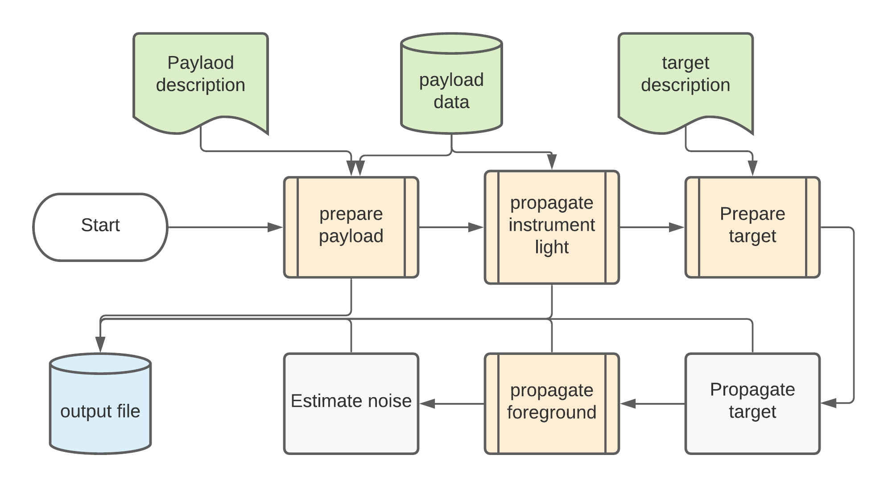

.. _introduction:

============
Introduction
============

ExoRad works in sequential steps; each of them is based on the :class:`~exorad.tasks.task.Task` class.

A :class:`~exorad.tasks.task.Task` needs to be initialised before use, as shown in the docstring.

First it needs to prepare the payload. This starts from the payload description file and other included data, if present.
ExoRad reads `xml` file using the task :class:`~exorad.tasks.loadOptions.LoadOptions`.
