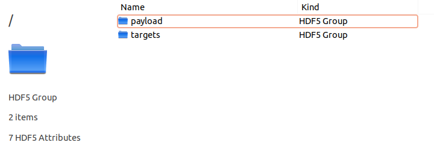
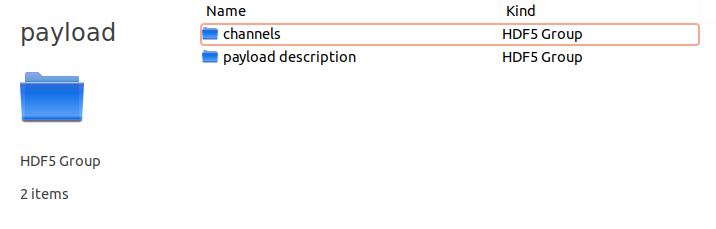
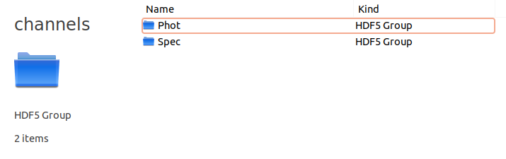
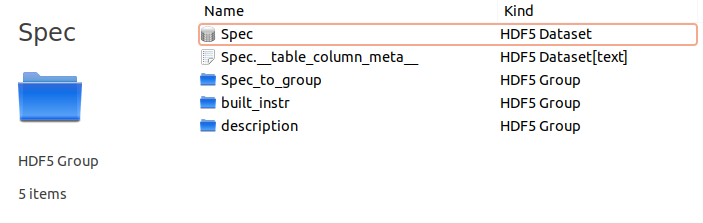
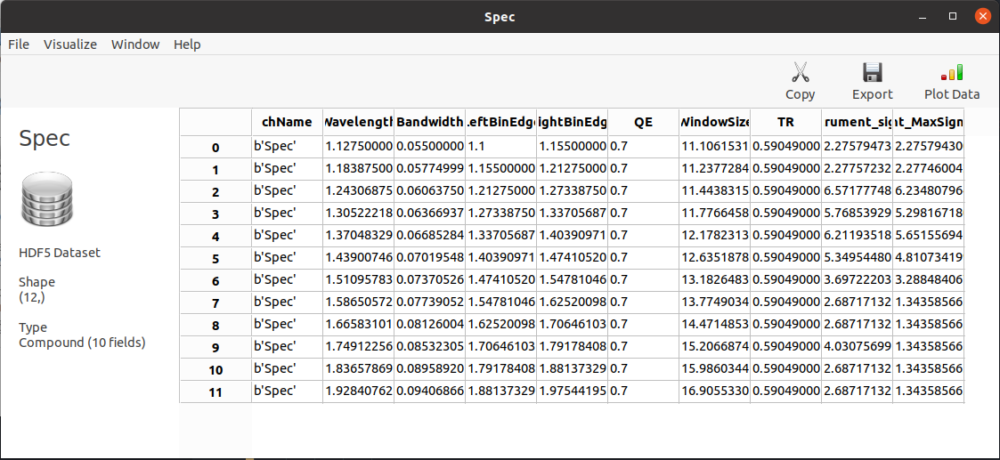
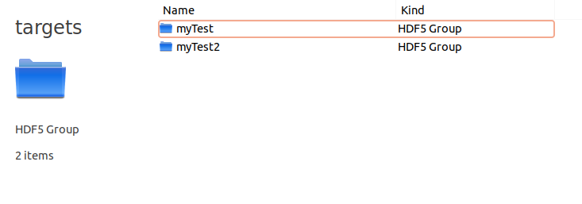
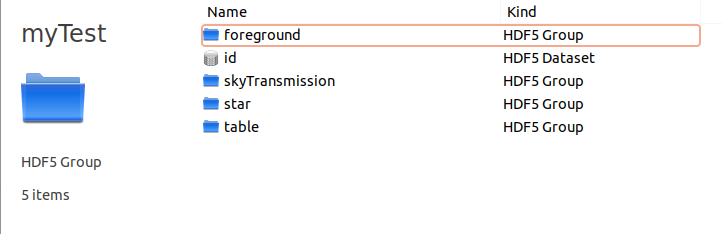
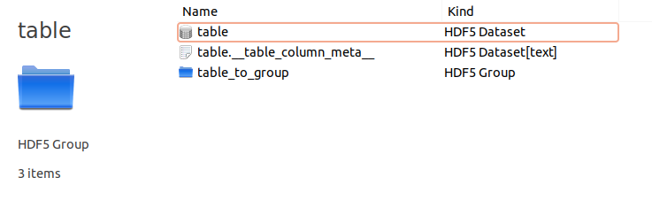

.. _outputs:

==========================
Understanding the outputs
==========================

It's easy.

The `.h5` file
===============
The main output product is a HDF5_ `.h5` file.
This format has many viewers such as HDFView_ or HDFCompass_ and APIs such as Cpp_, FORTRAN_ and Python_.

payload
---------
.. _payload-output:

The `payload` group contains all the information related to the instrument. Inside you will find a group for each channel
and a group called `payload description` containing the parsed `xml` payload description file.

Inside the `channels` group you will find a group for each channel called as the channel name.
In this case you have `Phot` and `Spec` as they are the channels contained in `payload_example.xml`.

Let's open a channel now.

Inside each channel you find a dataset that is called as the channel. This is the main channel output table.

Inside the text dataset called as the channel plus `_table_column_meta_` are contained the table metadata.
The couple dataset + metadata text can be read into an astropy quantity table (QTable_) with the function :func:`~exorad.output.hdf5.load`.
The `_to_group` directory contains the just described table converted into a dictionary and stored.

The `description` group contains the parsed section of the payload description file that contains the channel information.

Finally, the `built_instr` directory contains processed information related to the channel that allow ExoRad to load an
already built channel without initialize again the instrument.

Understanding the Channel table
+++++++++++++++++++++++++++++++

The channel table contained in the `channels` group is a table that contains all the information about the channel.
Every row reprents a spectral bin. In the following we describe the columns of the table:

.. list-table:: Table keywords
   :widths: 20 60
   :header-rows: 1

   * - Parameter
     - Description
   * - `ChName`
     - The name of the channel. Which is just the repetition of the channel name.
   * - `Wavelength`
     - The central wavelength of the spectral bin.
   * - `Bandwidth`
     - The bandwidth of the spectral bin.
   * - `LeftBinEdge`
     - The left edge of the spectral bin.
   * - `RightBinEdge`
     - The right edge of the spectral bin.
   * - `QE`
     - The quantum efficiency of the detector in the spectral bin.
   * - `WindowSize`
     - The window size of the detector in the spectral bin in pixels.
   * - `TR`
     - The total transmission of the channel in the spectral bin.
   * - `instrument_signal`
     - The signal of the instrument in the spectral bin [ct/s].
   * - `instrument_MaxSignal_inPixel`
     - The maximum signal collected by a pixel of the instrument in the spectral bin [ct/s].

Target
---------
.. _target-output:

Inside the `targets` group you will find a directory for each target.

Inside each target there will be a list of subdirectories containing everything that concerns the target.
For example you will find here all the information about the `foregrounds` and the `star`.
`skyTransmission` is the total transmission resulting from all the foregrounds.

The final results are stored in the `table` group.

Understanding the Target table
+++++++++++++++++++++++++++++++

The target table contained in the `targets` group, under a folder named after the observed target, is the table that contains all the final products of the simulations.
Every row reprents a spectral bin. In the following we describe the columns of the table:

.. list-table:: Table keywords
   :widths: 20 60
   :header-rows: 1

   * - Parameter
     - Description
   * - `ChName`
     - The name of the channel. Which is just the repetition of the channel name.
   * - `Wavelength`
     - The central wavelength of the spectral bin.
   * - `Bandwidth`
     - The bandwidth of the spectral bin.
   * - `LeftBinEdge`
     - The left edge of the spectral bin.
   * - `RightBinEdge`
     - The right edge of the spectral bin.
   * - `QE`
     - The quantum efficiency of the detector in the spectral bin.
   * - `WindowSize`
     - The window size of the detector in the spectral bin in pixels.
   * - `TR`
     - The total transmission of the channel in the spectral bin.
   * - `instrument_signal`
     - The signal of the instrument in the spectral bin [ct/s].
   * - `instrument_MaxSignal_inPixel`
     - The maximum signal collected by a pixel of the instrument in the spectral bin [ct/s].
   * - `skyFilter_signal`
     - The signal of the sky filter (e.g. Earth's atmosphere) in the spectral bin [ct/s].
   * - `skyFilter_MaxSignal_inPixel`
     - The maximum signal collected by a pixel of the sky filter in the spectral bin [ct/s].
   * - `zodi_signal`
     - The signal of the zodiacal light in the spectral bin [ct/s].
   * - `zodi_MaxSignal_inPixel`
     - The maximum signal collected by a pixel of the zodiacal light in the spectral bin [ct/s].
   * - `foreground_transmission`
     - The total transmission of the foregrounds in the spectral bin. This is the transmission of all the elements in front of the telescope, as the transmission of the optical elements in the channel optical path is included in `TR`.
   * - `starFlux`
     - The flux of the star in the spectral bin [W/m^2].
   * - `star_signal`
     - The signal of the star in the spectral bin [ct/s].
   * - `star_MaxSignal_inPixel`
     - The maximum signal collected by a pixel of the star in the spectral bin [ct/s].
   * - `MaxSignal_inPixel`
     - The maximum signal collected by a pixel in the spectral bin [ct/s]. This is the combination of previous max signals. Note that the maximum signal in a pixel is the sum of the maximum signals of the instrument, sky filter, zodiacal light and star, and this is because using the same PSF, the most illuminated pixel is always the same.
   * - `saturation_time`
     - The time in seconds to saturate a pixel in the spectral bin [s].
   * - `frameTime`
     - The time in seconds to read a frame in the spectral bin [s]. This corresponds to the minimum saturation time in the detector.
   * - `instrument_signal_noise`
     - The noise of the instrument signal in the spectral bin for an hour integration time [ct h^(1/2)].
   * - `skyFilter_signal_noise`
     - The noise of the sky filter signal in the spectral bin for an hour integration time [ct h^(1/2)].
   * - `zodi_signal_noise`
     - The noise of the zodiacal light signal in the spectral bin for an hour integration time [ct h^(1/2)].
   * - `star_signal_noise`
     - The noise of the star signal in the spectral bin for an hour integration time [ct h^(1/2)].
   * - `darkcurrent_noise`
     - The noise of the dark current in the spectral bin for an hour integration time [ct h^(1/2)].
   * - `readout_noise`
     - The noise of the readout in the spectral bin for an hour integration time [ct h^(1/2)].
   * - `total_noise`
     - The total noise in the spectral bin for an hour integration time [ct h^(1/2)].

Additionally, custom noises can appear in the table if they are included in the simulation (e.g., `gain_noise`).

.. note::
   The noise values are calculated for an hour integration time. If you want to calculate the noise for a different integration time, you can use the formula:

   .. math::
      \text{noise} = \text{noise}_{\text{hour}} \times \sqrt{\frac{\text{integration time}}{3600 \text{ s}}}

   where `noise_{hour}` is the noise value for an hour integration time.

.. note::
   The first part of the table is the same as the channel table, as the target table is the result of the combination of the channel table with the foregrounds and the star.

.. _QTable: https://docs.astropy.org/en/stable/api/astropy.table.QTable.html

.. _HDF5: https://www.hdfgroup.org/solutions/hdf5/

.. _HDFView: https://www.hdfgroup.org/downloads/hdfview/

.. _HDFCompass: https://support.hdfgroup.org/projects/compass/

.. _FORTRAN: https://support.hdfgroup.org/HDF5/doc/fortran/index.html

.. _Cpp: https://support.hdfgroup.org/HDF5/doc/cpplus_RM/index.html

.. _Python: https://www.h5py.org/
