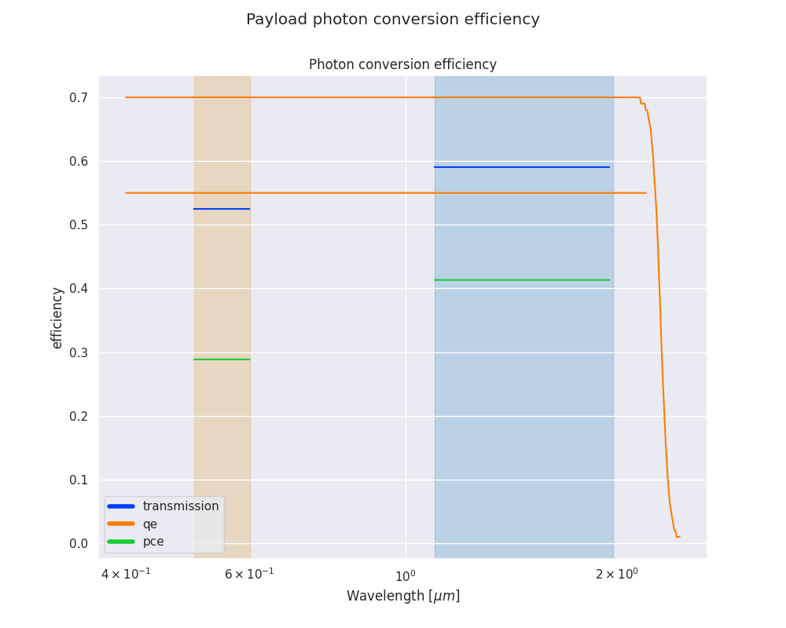
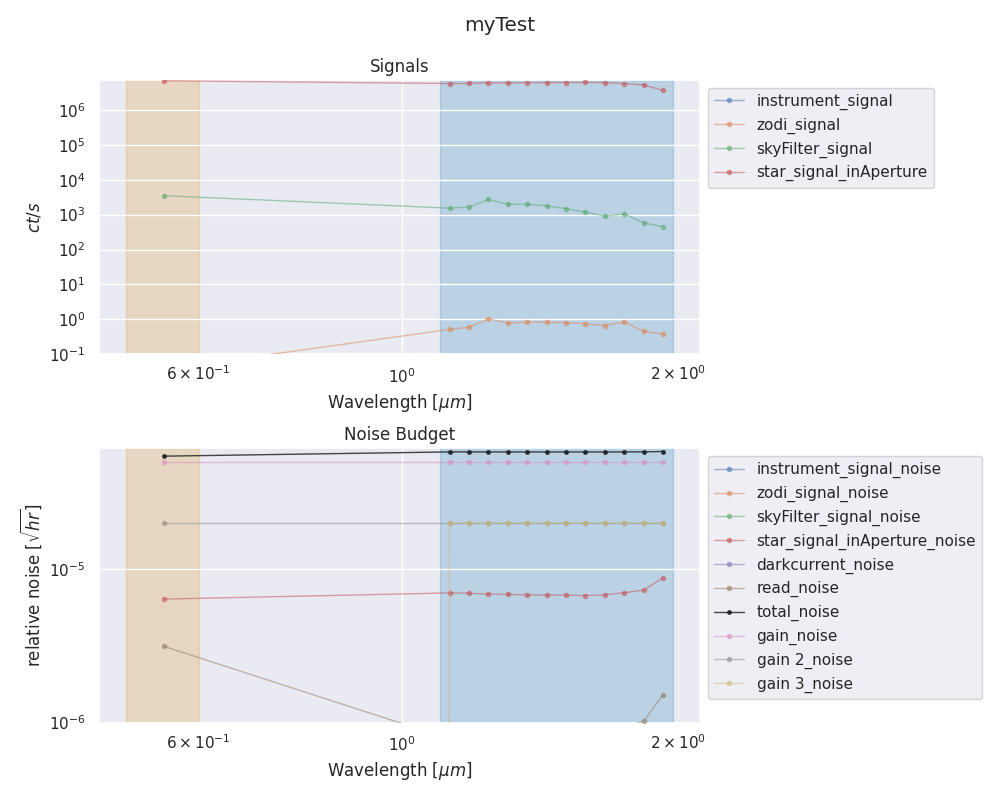

.. _quickstart_guide:

=================
Quickstart guide
=================

Let's warm up with an example run. We will now try to use ExoRad with an example provided by the developer: if it doesn't work, don't blame us.
The starting points will be the target list ``examples\test_target.csv`` and the payload description ``examples/payload_example.xml``.

The target list
----------------

The provided target list is a full example of one of the input format supported.
It's a comma separated value table containing all the target information required by ExoRad.
This default example is build upon a star as target, but we will see later that you can set up Exorad to work with any kind of celestial object, as long as it is a point source.
Also, in this example we only have one target in the file, but ExoRad is made to handle a list of targets: you just have to add lines to your csv file.

Payload description file
-------------------------
The payload description file is a xml file with all the payload specifics.
In the example one you will find a full example of all the possibilities you can have from ExoRad v 2.0.
Other will come and will be described separately.

In order to make ExoRad work you have now to edit this file.
The first element of the file is `ConfigPath`. You have to change the value to point to the ExoRad installation folder.
This is important because it tells ExoRad where to find all the payload related file.

Our First run
--------------
We can now run ExoRad for the firs time.
Navigate into your installation folder::

    cd /your_path/ExoRad

and open the file `examples/payload_example.xml`.
Replace the value of the keyword `ConfigPath` located at the second row, with your installation folder path as

    .. code-block:: xml

        <ConfigPath> /your_path/ExoRad
            <comment>Main directory for the configuration files</comment>
        </ConfigPath>

From the installation folder open the command line and write::

    exorad -t examples/test_target.csv -p examples/payload_example.xml -o examples/first_run.h5

Now we are asking to ExoRad to analyse `examples/test_target.csv` target list using the `examples/payload_example.xml` payload and to save the results in `example` directory using a `first_run.h5` format.

For a description of the flags, you can run::

    exorad --help

Here is a summary of the most important flags

==================  =======================================================================
flags               description
==================  =======================================================================
-p, --payload       Input payload description file
-t, --targetlist    Input target list file
-o, --outDir        Output directory
-c, --full_contrib  plot all the contributions to the signal
-d, --debug         Log output on screen
-P, --plot          automatically produce plots
-n, --nThreads      number of threads for parallel processing
-l, --log           store the log output on file
==================  =======================================================================

Now you can navigate into `examples` and you will find ExoRad outcomes.
You will find a copy of the payload description file and of the target list and one h5 file containing all your output.

Producing some plots
--------------------------------
ExoRad can produce some simple diagnostic plots from the output. You can enable this option just by adding the flag `-P`
to the command::

    exorad -t examples/test_target.csv -p examples/payload_example.xml -o examples/first_run.h5 -P

Now ExoRad will produce a `png` file for each target in the targetlist and one for the instrument efficiency.

The efficiency plot shows for the investigated wavelength range the instrument quantum efficiency, transmission
and the resulting photon conversion efficiency.

The target picture will contain a panel for the signal information with a cut for contributes lower than 1e-3, and a panel for the noise budget with a cut for contributions lower than 1e-7.

You can also produce a plot of an ExoRad `.h5` output file by::

    exorad-plot -i examples/first_run.h5 -o examples/plots

and ExoRad will produce a plot for each of the target inside the pickle file.

The exorad-plot command also accepts the either a list of a range of number of target to plot in the h5 file of the name of the target to plot::

    exorad-plot -i examples/first_run.h5 -o examples/plots -n 0

to plot the first target in the list::

    exorad-plot -i examples/first_run.h5 -o examples/plots -n 0:1

to plot the target between 0 and 1. If you have 1000 targets you can plot every range or a list of target (eg -n 1,2,50 or -n 1:30)

The target name option allows you to plot a single target selected by name::

    exorad-plot -i examples/first_run.h5 -o examples/plots -t myTest

